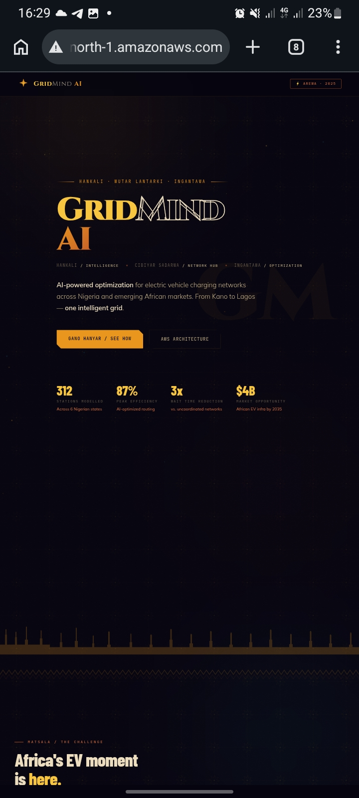
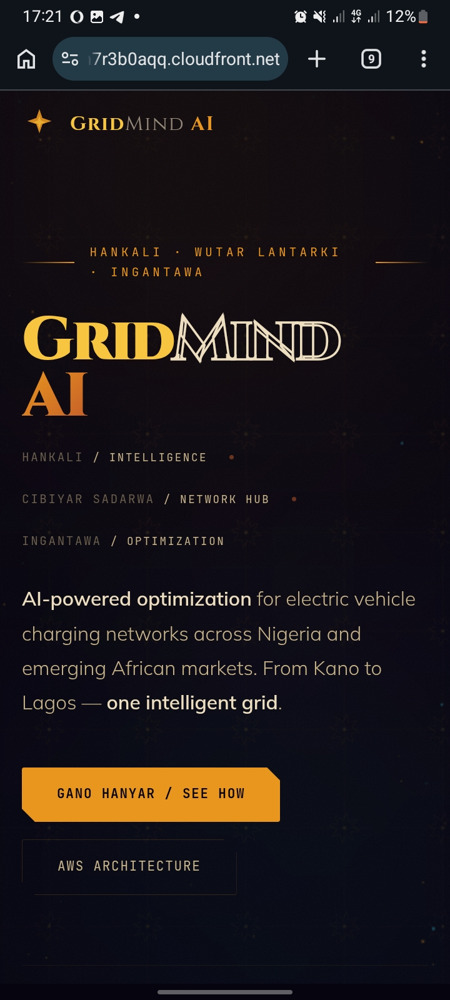
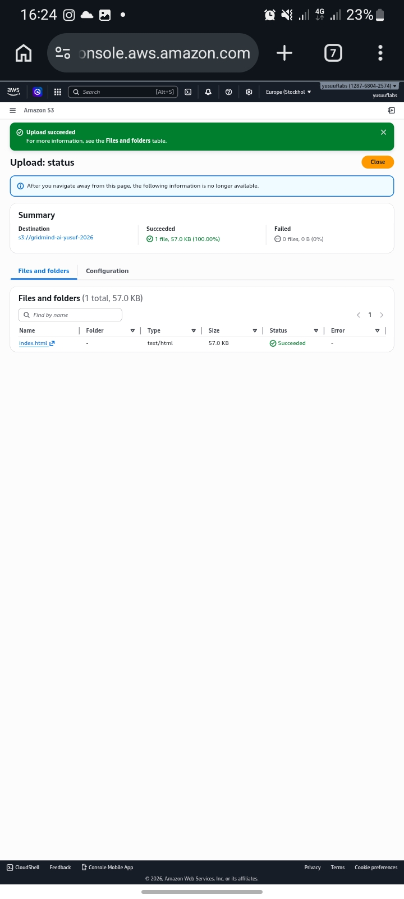

<div align="center">

<!-- HEADER BANNER -->


<!-- BADGES -->


<br/>


<br/><br/>

> *"Hankali · Gajimare · Ingantawa"*  
> **Intelligence · Cloud · Optimization**  
>
> *AI-powered optimization for electric vehicle charging networks across Nigeria and Africa.*

<br/>

</div>

---

## 📋 Table of Contents

| # | Section |
|---|---------|
| 1 | [Project Overview](#-project-overview) |
| 2 | [Live Demo](#-live-demo) |
| 3 | [Architecture](#-cloud-architecture) |
| 4 | [Deployment Steps](#-deployment-steps) |
| 5 | [Screenshots](#-screenshots) |
| 6 | [Repository Structure](#-repository-structure) |
| 7 | [Technologies Used](#-technologies-used) |
| 8 | [Cleanup](#-cleanup) |
| 9 | [Key Learnings](#-key-learnings) |
| 10 | [About the Builder](#-about-the-builder) |

---

## 🚀 Project Overview

This capstone project was completed as the **final assessment** for the **ST@40 Digital Skills Initiative — Cloud Engineering Track** at [Schull.io](https://schull.io).

The project demonstrates **end-to-end static website deployment** using core AWS services, following the same infrastructure patterns used by real-world technology startups.

### What Was Built

**GridMind AI** — a concept landing page for an AI-powered EV charging optimization platform targeting Nigeria and emerging African markets — deployed to the cloud using a professional, production-grade AWS architecture.

### What This Project Demonstrates

| Skill | Description |
|-------|-------------|
| ☁️ **Cloud Storage** | Creating and configuring an AWS S3 bucket for static website hosting |
| 🔐 **Access Policies** | Writing and applying IAM bucket policies for secure public read access |
| 🌐 **Global CDN** | Deploying a CloudFront distribution to serve content from 450+ edge locations |
| 🏗️ **Architecture Thinking** | Understanding how S3 + CloudFront form a production-grade hosting stack |
| 📁 **File Management** | Uploading, organizing, and verifying deployment artifacts |
| 🧹 **Cost Awareness** | Proper cleanup of cloud resources to avoid unexpected charges |

---

## 🌍 Live Demo

| Endpoint | URL | Status |
|----------|-----|--------|
| **CloudFront (Global CDN)** | `https://dtklm7r3b0aqq.cloudfront.net` | ✅ Live |
| **S3 Website Endpoint** | `http://gridmind-ai-yusuf-2026.s3-website-us-east-1.amazonaws.com` | ✅ Live |

> **Note:** Both URLs serve identical content. CloudFront is the production-grade endpoint — it caches content at edge locations globally, providing lower latency for any user on Earth.

---

## 🏛️ Cloud Architecture

```
                    ┌─────────────────────────────────────────────────────────────┐
                    │                   AWS DEPLOYMENT ARCHITECTURE                │
                    │                  GridMind AI · Static Website                │
                    └─────────────────────────────────────────────────────────────┘

  ┌──────────────┐        HTTPS         ┌─────────────────┐       Cache Miss       ┌──────────────────┐
  │              │ ────────────────────▶│                 │ ─────────────────────▶ │                  │
  │     User     │                      │   CloudFront    │                         │    S3 Bucket     │
  │   (Browser)  │ ◀────────────────────│   Distribution  │ ◀─────────────────────  │  Static Website  │
  │              │    Cached Response   │                 │      index.html         │     Hosting      │
  └──────────────┘   (sub 50ms global)  └─────────────────┘                        └──────────────────┘
                                               │
                                    450+ Edge Locations
                                    Worldwide · Low Latency
                                    SSL/TLS Termination
                                    HTTP → HTTPS Redirect


  ORIGIN:  gridmind-ai-yusuf-2026.s3-website-us-east-1.amazonaws.com
  CDN:     dtklm7r3b0aqq.cloudfront.net
  REGION:  us-east-1 (N. Virginia)
```

### Why This Architecture?

| Component | Role | Real-World Benefit |
|-----------|------|--------------------|
| **S3 Bucket** | Origin server — stores all website files | Infinitely scalable, 99.999999999% durability, pay-per-GB |
| **CloudFront** | CDN — caches & distributes content globally | Faster load times worldwide, DDoS protection, HTTPS for free |
| **Bucket Policy** | Access control — allows public `GetObject` | Fine-grained security without making the whole bucket public |
| **Static Hosting** | S3 feature — serves files as a website | No web servers to manage, patch, or pay for |

---

## 🛠️ Deployment Steps

### Step 1 — Create the S3 Bucket

Navigate to **AWS Console → S3 → Create bucket**

| Setting | Value |
|---------|-------|
| Bucket name | `gridmind-ai-yusuf-2026` |
| AWS Region | `us-east-1` — US East (N. Virginia) |
| Block Public Access | **Disabled** *(uncheck all four options)* |
| Versioning | Disabled |
| Encryption | SSE-S3 (default) |

> ⚠️ **Important:** The bucket name must be globally unique across all AWS accounts. If `gridmind-ai-yusuf-2026` is taken, append additional characters.

---

### Step 2 — Apply Bucket Policy

Navigate to **S3 Bucket → Permissions → Bucket Policy → Edit**, then paste:

```json
{
  "Version": "2012-10-17",
  "Statement": [
    {
      "Sid": "PublicReadGetObject",
      "Effect": "Allow",
      "Principal": "*",
      "Action": "s3:GetObject",
      "Resource": "arn:aws:s3:::gridmind-ai-yusuf-2026/*"
    }
  ]
}
```

> 🔑 This policy allows anyone on the internet to **read** (download) files from the bucket — required for a public website. It does **not** allow uploading, deleting, or listing. Always replace the bucket name with your own.

---

### Step 3 — Enable Static Website Hosting

Navigate to **S3 Bucket → Properties → Static website hosting → Edit**

| Setting | Value |
|---------|-------|
| Static website hosting | **Enable** |
| Hosting type | Host a static website |
| Index document | `index.html` |
| Error document | `index.html` *(optional — for SPA support)* |

Click **Save changes**. You will receive an **S3 website endpoint URL** — copy it for the CloudFront setup.

---

### Step 4 — Upload Website Files

Navigate to **S3 Bucket → Objects → Upload**

1. Click **Add files**
2. Select `index.html` from your local machine
3. Click **Upload**

> 📌 Upload files directly — **do not upload the containing folder**. The `index.html` file must sit at the root of the bucket, not inside a subfolder.

---

### Step 5 — Create CloudFront Distribution

Navigate to **AWS Console → CloudFront → Create distribution**

| Setting | Value |
|---------|-------|
| Origin domain | *(Paste your S3 website endpoint — select from dropdown)* |
| Protocol | HTTP only |
| Default root object | `index.html` |
| HTTP → HTTPS | **Redirect HTTP to HTTPS** |
| Web Application Firewall | Do not enable |
| Price class | Use all edge locations |

Click **Create distribution** and wait approximately **5–15 minutes** for status to change from `Deploying` → `Enabled`.

---

### Step 6 — Verify Deployment

Test both endpoints:

```bash
# Test S3 Website Endpoint
curl -I http://gridmind-ai-yusuf-2026.s3-website-us-east-1.amazonaws.com
# Expected: HTTP/1.1 200 OK

# Test CloudFront Endpoint
curl -I https://dtklm7r3b0aqq.cloudfront.net
# Expected: HTTP/1.1 200 OK
```

Or simply open both URLs in your browser — both should display the GridMind AI landing page.

---

## 📸 Screenshots

### Screenshot 1 — S3 Website Endpoint
> The webpage served directly from the S3 static hosting endpoint.

```
📁 images/screenshot1-s3-website.png
```



---

### Screenshot 2 — CloudFront URL
> The same webpage delivered via the CloudFront CDN distribution.

```
📁 images/screenshot2-cloudfront-url.png
```



---

### Screenshot 3 — S3 Bucket Files
> The uploaded `index.html` file visible in the S3 Objects view.

```
📁 images/screenshot3-s3-files.png
```



---

## 📁 Repository Structure

```
gridmind-capstone-project/
│
├── 📄 index.html                          # The GridMind AI landing page
│
├── 📂 images/
│   ├── 🖼️  screenshot1-s3-website.png     # S3 website endpoint proof
│   ├── 🖼️  screenshot2-cloudfront-url.png # CloudFront CDN proof
│   └── 🖼️  screenshot3-s3-files.png       # S3 uploaded files proof
│
└── 📋 README.md                           # This documentation file
```

---

## 🧰 Technologies Used

<div align="center">

| Service | Category | Purpose in This Project |
|---------|----------|------------------------|
|  **Amazon S3** | Cloud Storage | Hosts all website files, serves as the website origin |
|  **Amazon CloudFront** | CDN | Distributes content globally from edge locations |
| **IAM Bucket Policy** | Security | Controls public read access to the S3 bucket |
| **HTML5 / CSS3 / JS** | Frontend | The GridMind AI website |
| **Git + GitHub** | Version Control | Source code management and submission |

</div>

---

## 🧹 Cleanup

After confirming and documenting successful deployment, resources were deleted to avoid ongoing AWS charges.

### Step 1 — Disable & Delete CloudFront Distribution

1. Navigate to **CloudFront → Distributions**
2. Select the distribution → click **Disable**
3. Wait for status to update to `Disabled` (~5 minutes)
4. Select the distribution → click **Delete**

### Step 2 — Delete S3 Bucket

1. Navigate to **S3 → Buckets**
2. Select `gridmind-ai-yusuf-2026`
3. Click **Empty** first — delete all objects inside
4. After the bucket is empty, click **Delete bucket**

> 💡 **Cost note:** Even within the AWS Free Tier, it is best practice to clean up resources after projects. S3 charges per GB stored and per request; CloudFront charges per GB transferred. For a simple HTML file with low traffic, the total cost is typically **$0.00 – $2.00/month** — but $0.00 is better.

---

## 💡 Key Learnings

Through this capstone project, the following real-world cloud engineering skills were applied and reinforced:

**1. S3 is not just storage — it's a web server.**  
Enabling static website hosting on S3 turns a simple storage bucket into a fully functional web host, without needing to provision, manage, or patch a single server.

**2. Bucket policies are not the same as ACLs.**  
A bucket policy is a JSON-based resource policy that gives precise, auditable control over who can do what to which resources. This is the production standard — not clicking "make public".

**3. CloudFront is not optional for production.**  
S3 website hosting is regional — it lives in one AWS data centre. CloudFront replicates and caches your content across 450+ global edge locations, dramatically reducing latency for users anywhere on Earth and adding SSL/TLS termination.

**4. Cost awareness is an engineering skill.**  
Knowing when and how to clean up cloud resources is part of being a responsible cloud engineer. Orphaned resources accumulate charges silently.

**5. Documentation is part of the deliverable.**  
A deployment without documentation is incomplete. Good README files communicate architecture decisions, enable reproducibility, and demonstrate professional engineering standards.

---

## 👨🏾‍💻 About the Builder

<div align="center">

```
╔══════════════════════════════════════════════════════╗
║                                                      ║
║              YUSUF MUSA                              ║
║              Cloud · Data · AI Engineer              ║
║              Arewa, Nigeria                          ║
║                                                      ║
║   Programme:  ST@40 Digital Skills Initiative        ║
║   Track:      Cloud Engineering                      ║
║   Platform:   Schull.io                              ║
║   Cohort:     2025                                   ║
║                                                      ║
╚══════════════════════════════════════════════════════╝
```

</div>

Building at the intersection of cloud infrastructure, machine learning, and real-world African impact. This capstone project — GridMind AI — is a demonstration of how modern cloud engineering can support Nigeria's emerging EV infrastructure and clean energy future.

**Contact for queries:** [engage@schulltech.com](mailto:engage@schulltech.com)

---

<div align="center">


**GridMind AI** · Capstone Project · ST@40 Digital Skills Initiative

*Deployed on AWS S3 + CloudFront · Built by Yusuf Musa · Schull.io 2025*

*"Bari mu kammala da ƙarfi." — Let's finish strong.* 💪🏽

</div>
